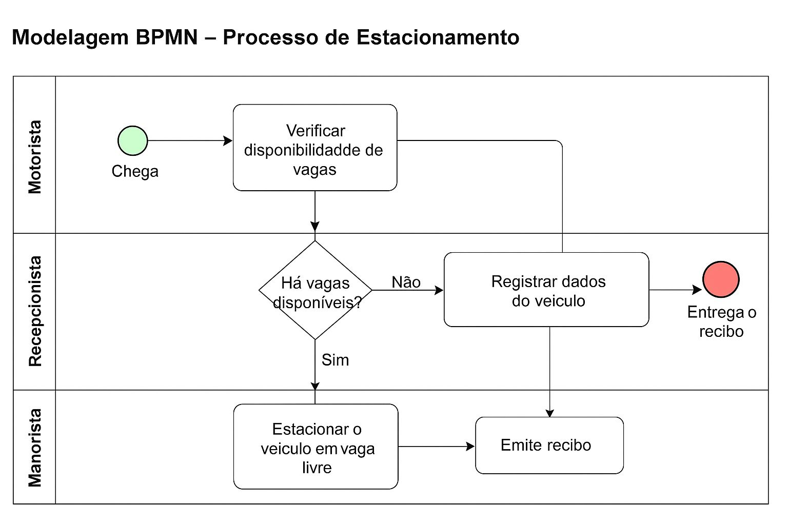

# 🚗 Modelagem BPMN – Processo de Estacionamento

## 📝 Descrição da Atividade
Esta atividade tem como objetivo observar e modelar o processo de **entrada e saída de veículos em um estacionamento**.  
O processo foi representado utilizando **BPMN (Business Process Model and Notation)**, com a finalidade de propor **novos requisitos** que otimizem o atendimento e o controle de vagas.

---

## 🚙 1. Descrição do Processo

1. O motorista chega à portaria de entrada.  
2. O recepcionista verifica com o manobrista se há vagas disponíveis.  
3. Se **não houver vagas**, o motorista é informado e sai.  
4. Se **houver vaga**, o recepcionista registra a placa, modelo, data e hora de entrada.  
5. O motorista entrega o carro ao manobrista.  
6. O manobrista estaciona o veículo em uma vaga livre.  
7. O recepcionista emite o recibo com a taxa e entrega ao motorista.

---

## 🧩 2. Estrutura BPMN (Bizagi Modeler)

O processo foi modelado com **três Lanes** dentro do Pool **“Estacionamento”**:

- **Motorista:** chega, entrega o carro e recebe o recibo.  
- **Recepcionista:** verifica vagas, registra dados e emite recibo.  
- **Manobrista:** confirma disponibilidade e estaciona o carro.

---

## ⚙️ 3. Requisitos Adicionais

| Tipo | Requisito Sugerido |
|------|--------------------|
| Funcional | Sistema de controle digital de vagas em tempo real |
| Funcional | Aplicativo para o manobrista localizar vagas livres |
| Funcional | Emissão automática de ticket com QR Code |
| Funcional | Sistema para registrar horário de saída e calcular valor total |
| Não Funcional | Sistema deve responder em até 2 segundos à consulta de vagas |
| Não Funcional | Interface intuitiva para recepcionista e manobristas |
| De Negócio | Reduzir tempo médio de entrada para menos de 2 minutos |

---

## ✅ 4. Conclusão

O processo modelado em **BPMN** permite visualizar claramente as interações entre **motorista, recepcionista e manobrista**,  
facilitando a identificação de gargalos e a proposição de **soluções tecnológicas** para otimizar o fluxo do estacionamento.

---

📅 **Tema:** Modelagem de Processos com BPMN  

  

