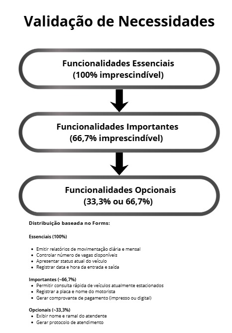

# Levantamento de Requisitos - Sistema de Administração de Estacionamento

**Autores:**  
- Maurício Monteiro Filho - 2302967  
- Emilly Silva Eduardo Pereira - 2403751  
- Gabrielly Soares Marinho - 2403430  

**Objetivo:**  
Por favor, classifique cada item conforme a prioridade:  

- **1️⃣ Imprescindível** – o sistema não pode funcionar sem este requisito.  
- **2️⃣ Opcional** – o requisito é útil, mas não é essencial.  

Sua opinião ajudará a definir as funcionalidades prioritárias para o desenvolvimento do sistema.

---

## Requisitos

1. **Gerar protocolo de atendimento para cada veículo.**  
   - Imprescindível  
   - Opcional  

2. **Registrar data e hora da entrada e saída de cada veículo.**  
   - Imprescindível  
   - Opcional  

3. **Apresentar o status atual do veículo (estacionado, aguardando pagamento, liberado).**  
   - Imprescindível  
   - Opcional  

4. **Exibir o nome e ramal do atendente responsável pelo registro.**  
   - Imprescindível  
   - Opcional  

5. **Calcular automaticamente o valor a ser pago com base no tempo de permanência.**  
   - Imprescindível  
   - Opcional  

6. **Gerar comprovante de pagamento (impresso ou digital).**  
   - Imprescindível  
   - Opcional  

7. **Controlar número de vagas disponíveis no estacionamento.**  
   - Imprescindível  
   - Opcional  

8. **Registrar a placa do veículo e o nome do motorista.**  
   - Imprescindível  
   - Opcional  

9. **Permitir consulta rápida de veículos atualmente estacionados.**  
   - Imprescindível  
   - Opcional  

10. **Emitir relatórios de movimentação diária e mensal (entrada, saída, faturamento).**  
    - Imprescindível  
    - Opcional  

---

**Link do formulário original:**  
[Formulário Google](https://docs.google.com/forms/d/e/1FAIpQLSe8F_qTcznWWbsiHnR-TM631YXwa139Uxt684N2GqrfGR-Hug/viewform)

!(imagens/REQUISITOS.png)

  

