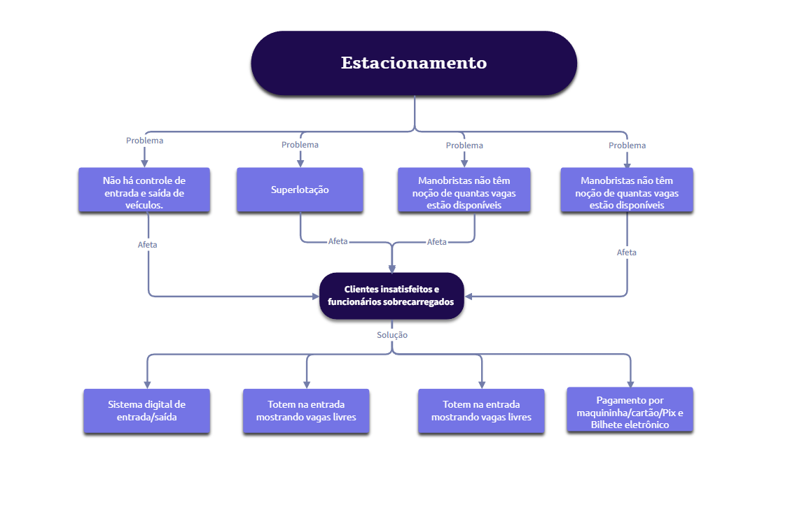

# Diagrama de Problemas e Soluções — Estacionamento

  

## Descrição
Este repositório contém o diagrama de causa e efeito relacionado à operação de um estacionamento. O objetivo do diagrama é identificar problemas recorrentes, seus impactos e propor soluções tecnológicas para melhorar a eficiência operacional e a experiência dos clientes.

## Estrutura do Diagrama
- **Tema central:** Estacionamento  
- **Problemas identificados:**
  - Não há controle de entrada e saída de veículos
  - Superlotação
  - Manobristas não têm noção de quantas vagas estão disponíveis (problema reforçado no diagrama)
- **Efeito causado:**  
  - Clientes insatisfeitos e funcionários sobrecarregados
- **Soluções propostas:**
  - Sistema digital de entrada/saída (controle automatizado)
  - Totem na entrada mostrando vagas livres (exibição em tempo real)
  - Pagamento automatizado por maquininha/cartão/Pix e bilhete eletrônico

## Objetivo
Demonstrar de forma visual e objetiva como a falta de controle e informação em um estacionamento afeta clientes e equipe, e como soluções digitais podem reduzir erros, diminuir filas e aumentar a satisfação.

## Como usar este repositório
1. Coloque a imagem do diagrama na pasta `images/` com o nome `diagrama-estacionamento.png`.  
   - Ex.: `images/diagrama-estacionamento.png`
2. Abra o `README.md` no seu repositório (o caminho da imagem pode ser ajustado se necessário).
3. Utilize este README como documentação introdutória para apresentações, propostas de projeto ou como referência para desenvolvimento de protótipo.

## Possíveis próximos passos (implementação)
- Prototipar um sistema de controle de entrada/saída (ex.: Raspberry Pi + leitor de QR/placa).
- Desenvolver dashboard com contagem de vagas em tempo real (backend + frontend).
- Implementar painel/totem que consuma a API de vagas disponíveis.
- Integrar métodos de pagamento eletrônicos e bilhetes eletrônicos.

## Contato
- Autor: Gabi (Gabrielly Marinho)  
- E-mail: gabrielly.soares05marinho@gmail.com

## Licença
Este projeto está sob a licença MIT. Sinta-se livre para reutilizar e adaptar o conteúdo.

---

