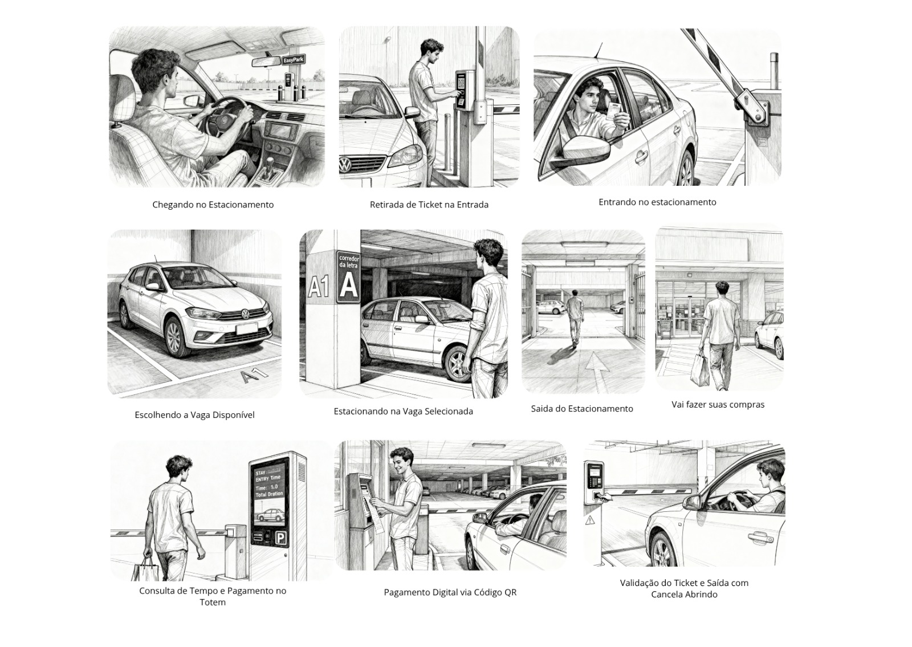

# Storyboard – Estacionamento EasyPark

Este documento descreve o fluxo visual do usuário João ao utilizar o novo estacionamento EasyPark, ilustrando toda a jornada desde a chegada até a saída, com destaque para etapas digitais e presenciais. 

## Sequência das Etapas do Storyboard

1. **Chegada ao Estacionamento**  
   João chega dirigindo ao estacionamento EasyPark.

2. **Retirada de Ticket na Entrada**  
   Ele para o carro próximo ao terminal e retira o ticket de estacionamento.

3. **Entrada com Cancela Abrindo**  
   João valida o ticket e a cancela se abre automaticamente para ele entrar.

4. **Escolhendo a Vaga Disponível**  
   Observa as vagas livres e escolhe a mais conveniente.

5. **Estacionando na Vaga Selecionada**  
   Estaciona o carro na vaga escolhida, confirmando o código do corredor e da vaga (ex: A1).

6. **Saída do Estacionamento**  
   João sai do carro, segue pelo estacionamento e dirige-se à área de lojas.

7. **Vai Fazer Suas Compras**  
   Realiza suas compras e aproveita o tempo durante o período em que está estacionado.

8. **Consulta de Tempo e Pagamento no Totem**  
   Ao retornar, vai até o terminal para consultar o tempo que ficou e realiza o pagamento conforme instruções.

9. **Pagamento Digital via QR Code**  
   Efetua o pagamento usando QR Code no terminal digital de autoatendimento.

10. **Validação do Ticket e Saída com Cancela Abrindo**  
    João valida o ticket na cancela de saída, que se abre para ele passar tranquilamente com o carro.

## Finalidade

Este storyboard serve de referência para projetos de usabilidade, desenvolvimento de sistemas, treinamento e documentação operacional de estacionamentos automatizados.

## Etapas do Storyboard - Estacionamento

  

## Feedback do Usuário – João

> Como usuário do EasyPark, percebi melhorias importantes no processo de estacionamento.  
> Agora, ficou muito mais fácil chegar e identificar a vaga, pois os corredores e as pilastras estão bem sinalizados.  
> O uso do ticket ficou mais intuitivo, principalmente porque os terminais são modernos e têm o pagamento digital via QR code, evitando filas e agilizando a saída.  
> A experiência ficou mais organizada, tanto na entrada quanto na saída, e todo o fluxo foi bem pensado para facilitar minha rotina de compras.  
> Saí do estacionamento de forma tranquila e com a certeza de que o sistema foi eficiente!
